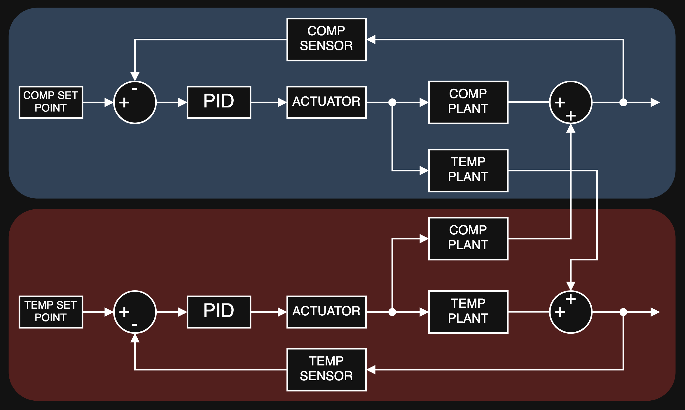
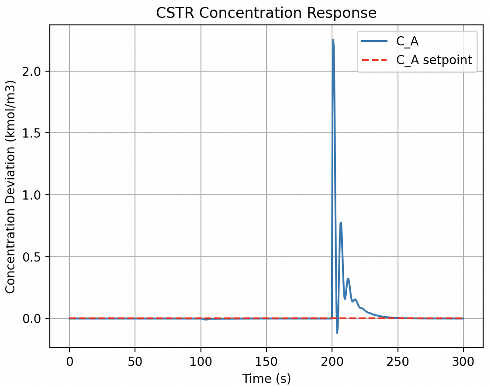
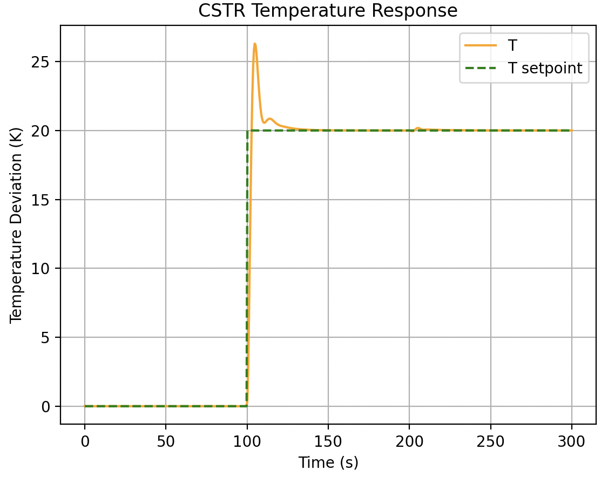

# mimo-cstr

Basic simulation of a coupled LTI MIMO chemical reactor (CSTR) system using the Python `control` library. The system has 2 MVs and 2 CVs.

- CV1: Reactor outlet composition ($C_A$)
- CV2: Reactor temperature ($T$)
- MV1: Reactor feed composition ($I_A$)
- MV2: Reactor coolant temperature ($T_c$)

## Model Background
The model is built off the following system:

$$A \to B$$

With the following assumptions:

- Irreversible
- First order with respect to A
- Well mixed approximation
- System properties are temperature invariant

The system is defined to operate at expected conditions of $T = 350$ Kelvin and $C_A = 1$ kmol/m3. 

Nomenclature:

| Symbol       | Meaning                                     | Units                                      |
| ------------ | ------------------------------------------- | ------------------------------------------ |
| $C_A$        | (CV) Reactor concentration of component $A$ | $\mathrm{kmol \cdot m^{-3}}$               |
| $T$          | (CV) System Temperature                     | $\mathrm{K}$                               |
| $I_A$        | (MV) Inlet concentration of component $A$   | $\mathrm{kmol \cdot m^{-3}}$               |
| $T_c$        | (MV) Coolant inlet temperature              | $\mathrm{K}$                               |
| $T_{in}$     | Feed temperature                            | $\mathrm{K}$                               |
| $C_p$        | System specific heat capacity               | $\mathrm{kJ \cdot K^{-1} \cdot kg^{-1}}$   |
| $\tau$       | Reactor space time                          | $\mathrm{s}$                               |
| $\rho$       | System density                              | $\mathrm{kg \cdot m^{-3}}$                 |
| $Q$          | Inlet and outlet volumetric flowrate        | $\mathrm{m^3 \cdot s^{-1}}$                |
| $UA$         | Heat transfer term                          | $\mathrm{kJ \cdot K^{-1} \cdot s^{-1}}$    |
| $\Delta H_r$ | Enthalpy of reaction                        | $\mathrm{kJ \cdot kmol^{-1}}$              |
| $V$          | System volume                               | $\mathrm{m^3}$                             |
| $E_a$        | Reaction activation energy                  | $\mathrm{kJ \cdot kmol^{-1}}$              |
| $P$          | Arrhenius pre-exponential factor            | $\mathrm{s^{-1}}$                          |
| $R$          | Ideal gas constant                          | $\mathrm{kJ \cdot kmol^{-1} \cdot K^{-1}}$ |
| $k$          | Reaction rate constant                      | $\mathrm{s^{-1}}$                          |

# Model Overview 
Material balance on component A in the CSTR yields:

$$\frac{dC_A}{dt} = \frac{Q}{V} I_A - \frac{Q}{V} C_A - k C_A$$

Energy balance on the CSTR yields:

$$\frac{dT}{dt} = \frac{Q}{V} (T_{in} - T) - J k C_A - \frac{UA (T - T_c)}{\rho C_p V}$$

The rate constant $k$ depends on temperature $T$:

$$k = P \exp \left ( \frac{-E_a}{RT} \right )$$

Therefore, the term $k C_A$ is nonlinear and not LTI. To linearise, the 1st order Taylor approximation of the term can be used, linearising around $T = T_0$ and $C_A = C_{A0}$:

$$C_A e^{-\frac{E_a}{RT}} \approx e^{-\frac{E_a}{R T_0}} C_{A0} + e^{-\frac{E_a}{R T_0}} (C_A - C_{A0}) + C_{A0} e^{-\frac{E_a}{R T_0}} \frac{E_a}{R T_0^2} (T - T_0)$$

Defining deviation variables:

- $C_A^{*} = C_A - C_{A0}$
- $T^{*} = T - T_0$
- $I_A^{*} = I_A - I_{A0}$
- $T_c^{*} = T_c - T_{c0}$

Applying the linearisation and substituting the deviation variables into the balance equations:

$$\frac{dC_A^{*}}{dt} = - \left(\frac{1}{\tau} + P e^{-\frac{E_a}{R T_0}}\right) C_A^{*} - \left(\frac{P E_a}{RT_0^2} e^{-\frac{E_a}{R T_0}} C_{A0}\right) T^{*} + \frac{1}{\tau} I_A^{*}$$

$$\frac{dT^{*}}{dt} = - J P e^{-\frac{E_a}{R T_0}} C_A^{*} + \left( J P e^{-\frac{E_a}{R T_0}} C_{A0} \frac{E_a}{RT_0^2} - \frac{1}{\tau} - \frac{UA}{\rho C_p V} \right ) T^{*} + \frac{UA}{\rho C_p V} T_c^{*}$$

This brings the model into the state space form:

$$\mathrm{\dot x} = A \mathrm{x} + B \mathrm{u}$$

With:

$$\mathrm{x} = [C_A^{*} \; T^{*}]^{\top} \; \; \; \; \mathrm{u} = [I_A^{*} \; T_c^{*}]^{\top}$$

The resulting plant is MIMO with bidirectional coupling between the two CVs. The system has no direct feedthrough from MVs to CVs.

## Control Overview
The process is controlled using closed loop PID feedback control. Each PID controller is SISO and influences only its respective MV.

The system assumes actuator and sensor dynamics, which introduce delay into the control loop. 

## Code files
The Python files contain the code representing this system.

- `setup.py` contains all the values and calculation of all physical constants (named in nomenclature above) and can be modified to the user's intent
- `blocks.py` defines the control loop blocks shown in the diagram above (sensors, actuators, controllers, setpoints)
- `simulation.py` defines the plant using data from `setup.py` and creates instances of the block objects defined in `blocks.py`. Runs the control simulation with the resulting system

The simulation input `u_inputs` contains four signals:

- CV1 setpoint change
- CV2 setpoint change
- CV1 disturbance
- CV2 disturbance

Setpoints and disturbances to the CVs can be applied at any point in the simulation. The system response to CV setpoint changes and/or CV disturbances is plotted. Below is an example of the system response to the following:

- A temperature setpoint change of 20 Kelvin (at 100s)
- A composition disturbance of 1.5 kmol/m3 (at 200s)

